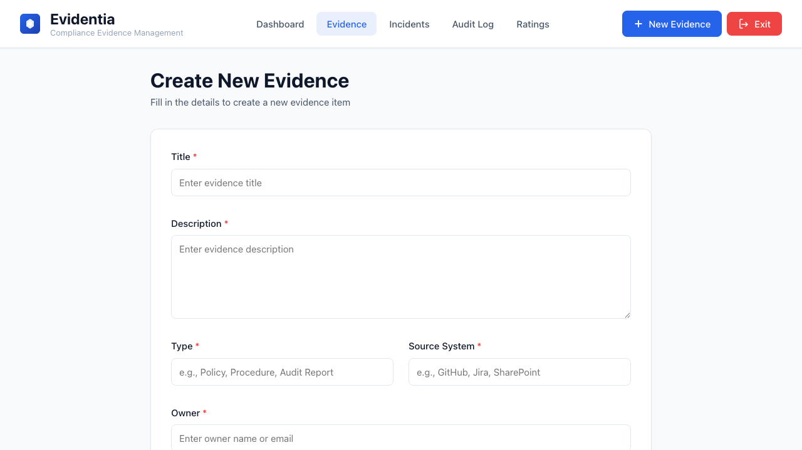
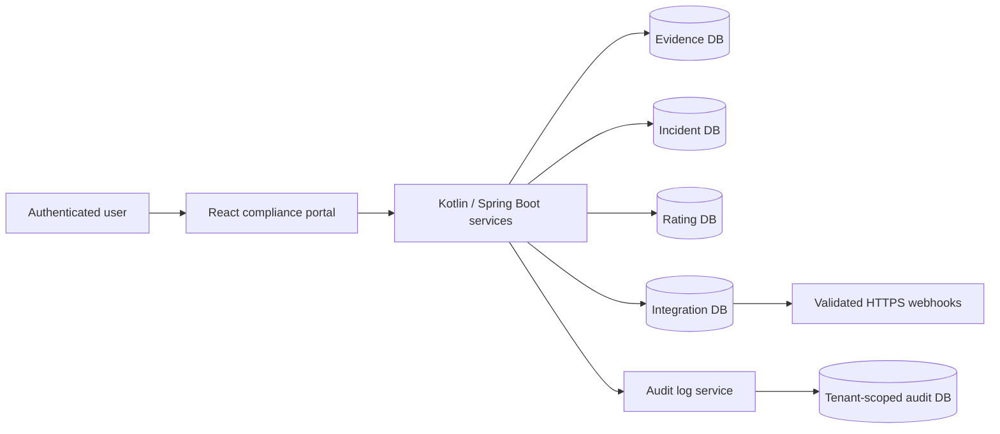

# Evidentia

[](https://github.com/giselleevita/evidentia/actions/workflows/ci.yml)

Evidentia is a compliance workflow reference implementation for turning existing IT and security activity into reviewable evidence.

**Private repository — reviewers:** see [docs/REVIEWER_GUIDE.md](docs/REVIEWER_GUIDE.md) for a 15-minute evaluation path (available on request).

It demonstrates lifecycle-driven evidence management, tenant-aware service boundaries,
correlated audit events, incident workflows, and external integration patterns in a
Kotlin/Spring Boot and React monorepo.



## Architecture



- **Backend**: Microservices architecture with Kotlin + Spring Boot
  - Evidence Service: Evidence lifecycle management (DRAFT → IN_REVIEW → APPROVED → LOCKED)
  - Audit Log Service: Centralized tenant-scoped audit event storage
  - Incident Service: Security incident tracking and resolution
  - Integration Service: External system integrations (Microsoft 365, GitHub, Jira)
- **Frontend**: React + TypeScript + Vite (compliance portal)
- **Database**: PostgreSQL with Flyway migrations (separate DBs per service)
- **Auth**: Azure Entra ID-compatible OIDC resource-server, frontend flows, and
  OAuth2 client-credentials authentication for internal audit delivery
- **Infrastructure**: Docker Compose locally, with partial Azure/Kubernetes reference templates

## Project Status

This repository demonstrates a multi-service architecture and local workflow. It is not
production hardened. Authentication, tenant isolation, integrations, migrations, and
deployment controls require independent validation before real-world use.

## Repository Structure

This is a **monorepo** containing all services, frontend, infrastructure, and documentation:

```
evidentia/
├── backend/                    # Backend microservices
│   ├── common/                 # Shared backend code (domain models, security, TenantContext)
│   ├── evidence-service/       # Evidence management service
│   ├── audit-log-service/      # Audit logging service
│   ├── incident-service/       # Incident governance service
│   └── integration-service/   # External integrations service
├── frontend/
│   └── compliance-portal/      # Main React application
├── shared/                     # Cross-stack shared resources
│   └── dto/                    # API contracts, OpenAPI specs
├── infra/                      # Infrastructure as Code
│   ├── docker/                 # Dockerfiles and docker-compose
│   ├── k8s/                    # Kubernetes manifests
│   ├── terraform/              # Terraform for Azure resources
│   └── pipelines/              # CI/CD pipeline definitions
└── docs/                       # Documentation
    ├── architecture/           # Architecture decision records
    └── setup/                  # Setup and deployment guides
```

## Quick Start

### Easiest Way to Start

**Start the local infrastructure, five backend services, and frontend with one command:**
```bash
./start.sh
```

Then open: **http://localhost:5173**

**Frontend only (fastest, for UI testing):**
```bash
./start-frontend-only.sh
```

**Stop everything:**
```bash
./stop.sh
```


### Prerequisites
- JDK 17+
- Node.js 20+
- Docker & Docker Compose
- Azure Entra ID application registration for authenticated end-to-end use

### Local Development (Manual)

1. **Start infrastructure services:**
```bash
cd infra/docker
docker compose up -d
```

2. **Configure Azure AD** (see [Local Dev Setup](docs/setup/local_dev.md))

3. **Run backend services:**
```bash
# Evidence Service (port 8080)
DATABASE_URL=jdbc:postgresql://localhost:15432/evidentia_evidence ./gradlew :backend:evidence-service:bootRun

# Audit Log Service (port 8081) - in another terminal
DATABASE_URL=jdbc:postgresql://localhost:5433/evidentia_audit ./gradlew :backend:audit-log-service:bootRun

# Incident Service (port 8083) - in another terminal
DATABASE_URL=jdbc:postgresql://localhost:5434/evidentia_incident ./gradlew :backend:incident-service:bootRun
```

4. **Run frontend:**
```bash
cd frontend/compliance-portal
npm install
npm run dev
```

See [Local Development Guide](docs/setup/local_dev.md) for detailed setup instructions.

## Development

### Running Tests
- **Backend**: `./gradlew test` (runs tests for all services)
- **Frontend**: `cd frontend/compliance-portal && npm run lint && npm test -- --run && npm run build`

### Building
- **Backend**: `./gradlew build`
- **Frontend**: `cd frontend/compliance-portal && npm run build`

### Database Migrations
Migrations run automatically via Flyway on service startup. Each service has its own database and migrations in `backend/{service}/src/main/resources/db/migration/`.

## Key Features

### Multi-Tenancy
Domain entities and repository interfaces carry tenant identifiers, and tenant context is
extracted from JWT claims. This reference implementation requires additional authorization
and isolation testing before production use.

### Audit Logging
Business-service write operations are designed to emit audit events to the audit-log-service with:
- Actor (user)
- Tenant ID
- Action
- Resource type and ID
- Correlation ID
- Timestamp
- Metadata

### Security
- OAuth2/OIDC with Azure Entra ID
- RBAC via Azure AD App Roles (Admin, Auditor, User)
- Method-level security with `@PreAuthorize` annotations
- Automatic tenant context extraction from JWT tokens
- OAuth2 client-credentials bearer tokens on business-service audit calls
- All endpoints authenticated by default except health and info endpoints
- OpenAPI endpoints disabled by default
- HTTPS-only public webhook targets with private-address rejection

See [RBAC Documentation](docs/architecture/RBAC.md) and
[Security Boundaries](docs/architecture/security-boundaries.md) for implemented
controls and known limitations.

## CI/CD

The active GitHub Actions workflow compiles and tests the backend and builds the frontend.
Container and deployment manifests are reference templates. They are not an
active production deployment pipeline.

See [Azure Deployment Guide](docs/setup/azure_deployment.md) for production deployment.

## Documentation

- [Architecture Documentation](docs/architecture/README.md)
- [RBAC and Role Definitions](docs/architecture/RBAC.md)
- [State Machines](docs/architecture/state-machines.md)
- [Local Development Setup](docs/setup/local_dev.md)
- [Azure Deployment Guide](docs/setup/azure_deployment.md)

## Contributing

1. Create a feature branch from `main`
2. Make changes following the existing architecture patterns
3. Add tests for new functionality
4. Update documentation as needed
5. Submit a pull request

## License

Copyright (c) 2026 Giselle Evita Koch. See [LICENSE](LICENSE) for the
proprietary source-available terms.
